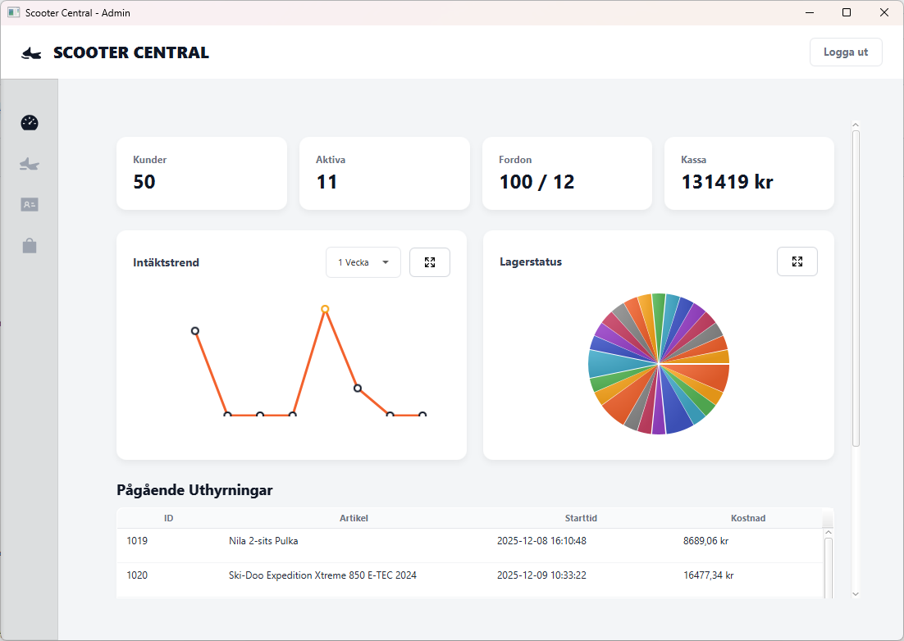
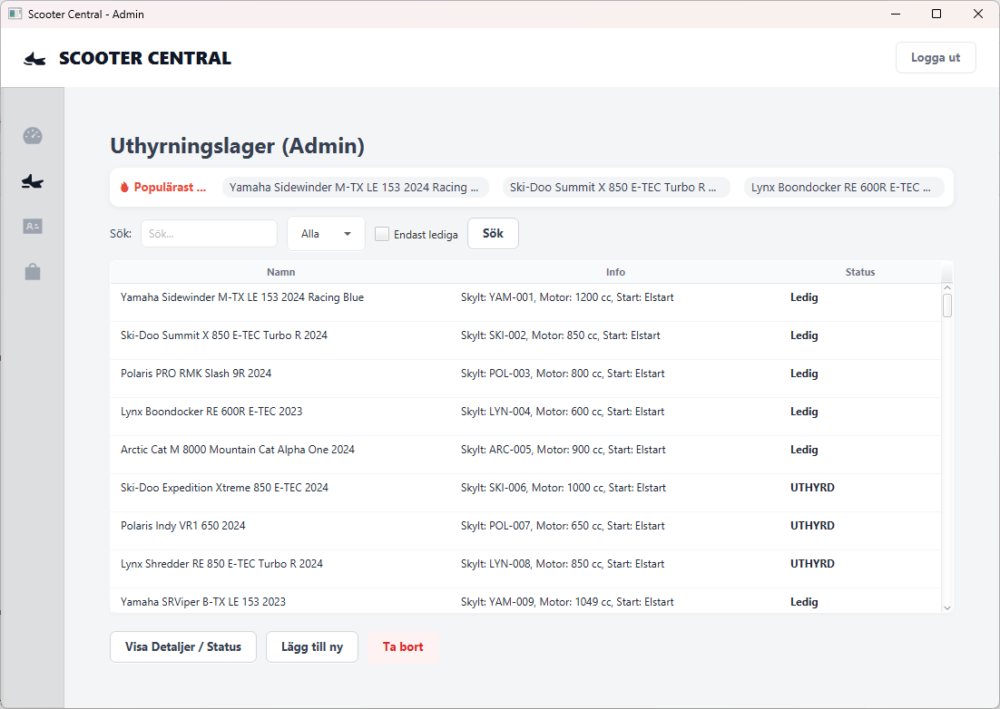
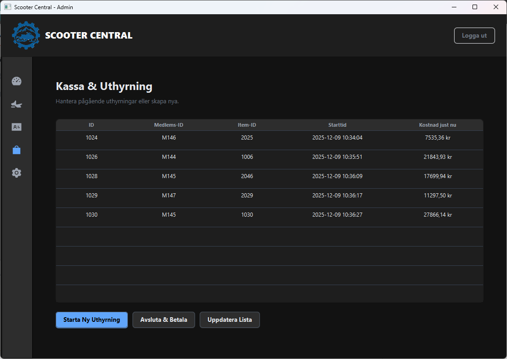

# ❄️ Scooter Central 🛵

[🇸🇪 Svenska](#-scooter-central-svenska) · [🇬🇧 English](#-scooter-central-english)

---

## 🇸🇪 Scooter Central (Svenska)

**Scooter Central** är ett robust, **JavaFX‑baserat administrationssystem** för uthyrning av snöskotrar och tillbehör.  
Applikationen hanterar hela flödet i en uthyrningsverksamhet – från lagerhantering och medlemsregister till aktiv uthyrning, prissättning och kvittohantering.

---

## 📋 Innehållsförteckning
- [🚦 Project status](#-project-status)
- [🖼️ Screenshots](#️-screenshots)
- [✨ Funktioner](#-funktioner)
- [🏗 Teknisk Arkitektur](#-teknisk-arkitektur)
- [📁 Projektstruktur](#-projektstruktur)
- [🚀 Installation & Körning](#-installation--körning)
- [🧭 Usage](#-usage)
- [🔐 Konfiguration & Säkerhet](#-konfiguration--säkerhet)
- [🛠 Utvecklingsprocess](#-utvecklingsprocess)
- [📄 Licens](#-licens)
- [🌍 English Version](#-scooter-central-english)

---

## 🚦 Project status

**Status:** 🟢 *Active – under pågående utveckling*  
Fokus: stabil uthyrningslogik, förbättrad UI‑upplevelse, ny konfigurationsmodul och stöd för mörkt läge.

---

## 🖼️ Screenshots

### Dashboard
_Realtidsvy med taxameter, nyckeltal och grafer._

### Uthyrningsflöde
_Hantera utrustning, medlemmar och pågående uthyrningar._

### Dashboard Dark
_Realtidsvy med taxameter, nyckeltal och grafer._

### Kassa
_Hantering av uthyrd utrustning._

---

## ✨ Funktioner

### 🖥️ Dashboard & Realtidsdata
- **Live Data:** Realtidsuppdatering av intäkter, uthyrningar och nyckeltal.  
- **Visualisering:** Grafiska presentationer av intäktstrender och populära modeller.  
- **Widgets:** Nyckelinformation om lagerstatus, aktiva kunder och dagskassa.

### ⚙️ Inställningar & Utseende *(NYTT)*
- **SettingsView:** Ny vy i admin‑menyn för säkerhet och design.  
- **Dark Mode:** Växla mellan ljust och mörkt tema – sparas automatiskt i `config/config.json`.  
- **Admin‑lösenord:** Ändra lösenord via GUI (nytt + bekräfta).  
- **Om‑sektion:** Visar applikationsversion och metadata.  
- **Logotyp:** Visas i login, header och på kvitton/fakturor.

### 📦 Lagerhantering
- **Polymorfism:** Hanterar flera typer (`Scooter`, `Sled`) med unika attribut.  
- **Streaming Search:** Filtrering i realtid med Stream API.  
- **Statusfärger:** Visuella indikatorer på tillgänglighet.

### 💳 Kassa & Uthyrning
- **Flöde:** Kopplar *Medlem + Utrustning + Prispolicy*.  
- **Prisstrategier:** `StandardPricePolicy`, `StudentPricePolicy` via *Strategy Pattern.*  
- **Dokumentation:** Professionella kvitton och fakturor, nu med logotyp.

### 👥 Medlemsregister (CRM)
- **CRUD:** Skapa, läs, uppdatera och ta bort medlemmar.  
- **Historik:** Spåra tidigare uthyrningar.  
- **Validering:** Regex‑baserad kontroll för medlems‑ID och kontaktinfo.

### 💾 Persistens & Säkerhet

- **Autosave:** Bakgrundstråd sparar data var 30:e sekund.  
- **JSON:** All data i lättläst format.  
- **ConfigHandler:** Ny konfigurationshanterare för lösenord och tema (`config/config.json`).  
- **Säkerhet:** Maskerat PasswordField och extern konfigfil.

---

## 🏗 Teknisk Arkitektur

Projektet följer en **lagerarkitektur (Layered Architecture)** med tydlig separation av ansvar.  

graph TD 
UI[UI Layer (Views)] --> Service[Service Layer] 
Service --> Persistence[Persistence Layer] 
Service --> Model[Model Layer] 
Persistence --> JSON[JSON Files] 
Persistence --> Config[ConfigHandler (config/config.json)] 
 

- **UI Layer (`se.scooterrental.ui`)** – JavaFX‑vyer (Login, Dashboard, Rental, Settings).  
- **Service Layer (`se.scooterrental.service`)** – Affärslogik, t.ex. `RentalService`, `Inventory`.  
- **Model Layer (`se.scooterrental.model`)** – POJO‑modeller (Item, Scooter, Sled, Member).  
- **Persistence Layer (`se.scooterrental.persistence`)** – GSON/JSON, samt `ConfigHandler` för inställningar.

---

## 📁 Projektstruktur
 
ScooterCentral/ 
├── .github/ 
│ └── workflows/maven.yml 
├── config/ 
│ └── config.json 
├── src/ 
│ ├── main/java/se/scooterrental/ 
│ │ ├── ui/ # JavaFX-vyer (Login, Dashboard, Settings) 
│ │ ├── service/ # Affärslogik (RentalService, Inventory) 
│ │ ├── model/ # Domänmodeller (Item, Scooter, Sled, Member) 
│ │ └── persistence/ # GSON-hantering, ConfigHandler 
│ └── main/resources/ # FXML, CSS, logo.png, övriga resurser 
│ └── test/java/ # Enhetstester 
├── pom.xml 
└── README.md 
 

---

## 🚀 Installation & Körning

**Förutsättningar**

- Java JDK **21** eller senare  
- Maven **3.8+**

**Körinstruktioner**

git clone https://github.com/alexwest81/ScooterCentral.git 
cd ScooterCentral 
mvn clean install 
mvn javafx:run 

*Eller kör `MainApp.java` direkt i IntelliJ / Eclipse.*

---

## 🧭 Usage

1. Starta applikationen och logga in som admin (standard: `admin`).  
2. Öppna **Inställningar** för att byta lösenord eller aktivera **Dark Mode**.  
3. Lägg till medlemmar, skotrar och utrustning.  
4. Starta och avsluta uthyrningar, generera kvitton och fakturor med logotyp.

---

## 🔐 Konfiguration & Säkerhet

`ConfigHandler` hanterar applikationsinställningar i `config/config.json`. Filen skapas automatiskt vid första start.

{ 
"adminPassword": "mitt-säkra-lösenord", 
"darkMode": true 
} 

- `verifyAdminPassword(String)` kontrollerar inloggning.  
- `setAdminPassword(String)` sparar nytt lösenord.  
- `isDarkMode()` returnerar aktuell temainställning.  
- `setDarkMode(boolean)` uppdaterar tema och sparar till fil.

Lösenord matas in via ett maskerat `PasswordField` i `LoginView`.

---

## 🎨 CSS & Design

- `.root.dark-mode` – Mörkt tema för bakgrunder, text och komponenter.  
- `.scorecard-title`, `.scorecard-value`, `.section-header`, `.settings-section` – konsekvent styling.  
- `.tab-content-area` – anpassad bakgrund i mörkt läge.  

Hårdkodade färger i t.ex. `DashboardView` är ersatta av CSS‑klasser för att stödja både ljust och mörkt tema.

---

## 🛠 Utvecklingsprocess

- **Concurrency:** Trådsäker autosave med `volatile` och `Platform.runLater`.  
- **Streams API:** Funktionell filtrering, sökning och statistik.  
- **Design Patterns:** Strategy (prissättning), Observer (UI‑uppdateringar), DTO/POJO.  
- **CI:** GitHub Actions‑workflow (`maven.yml`) för bygg och tester.

---

## 📄 Licens

Detta projekt är skapat för **utbildningssyfte**.  
Utvecklat av **Alex Weström**.

---

## 🇬🇧 Scooter Central (English)

**Scooter Central** is a robust **JavaFX‑based administration system** for snowmobile and equipment rentals.  
It covers the entire rental workflow – from inventory and customer management to pricing, receipts, and analytics.

---

### Overview

- JavaFX desktop application  
- Configurable admin login and Dark Mode  
- JSON‑based persistence with autosave  
- Printable receipts and invoices with logo  

---

### Features

- **Dashboard & Live Data:** Real‑time metrics, charts, and key indicators.  
- **Inventory:** Polymorphic items (`Scooter`, `Sled`) with live filtering.  
- **Point of Sale:** Member + Equipment + Price Policy flow.  
- **CRM:** Full member CRUD and rental history.  
- **SettingsView:** Change admin password and toggle Dark Mode.  
- **ConfigHandler:** Manages `config/config.json` for credentials and theme.

---

### Architecture

graph TD 
UI[UI Layer (Views)] --> Service[Service Layer] 
Service --> Persistence[Persistence Layer] 
Service --> Model[Model Layer] 
Persistence --> JSON[JSON Files] 
Persistence --> Config[ConfigHandler (config/config.json)] 
 

- UI: JavaFX views and controllers  
- Service: Business logic and coordination  
- Model: Domain entities  
- Persistence: Gson‑based JSON and configuration handling  

---

### Project Structure (English)

ScooterCentral/ 
├── config/config.json 
├── src/ 
│ ├── main/java/se/scooterrental/ 
│ │ ├── ui/ 
│ │ ├── service/ 
│ │ ├── model/ 
│ │ └── persistence/ 
│ └── main/resources/ 
└── pom.xml 
 

---

### Setup & Run

**Requirements**

- JDK 21+  
- Maven 3.8+

**Run**

git clone https://github.com/alexwest81/ScooterCentral.git 
cd ScooterCentral 
mvn clean install 
mvn javafx:run 

---

### Configuration

`config/config.json`:

{ 
"adminPassword": "your-secure-password", 
"darkMode": false 
} 

- Managed by `ConfigHandler` using Gson and JsonObject.  
- Automatically created on first run if missing.  
- Used by `LoginView` and `MainApp` to control security and theme.

---

### Styling

- Full Dark Mode support via `.root.dark-mode`.  
- Dedicated classes for scorecards, headers, and settings sections.  
- Consistent logo usage in login, main header, and printed receipts/invoices.

---

### License

This project is created for **educational purposes**.  
Developed by **Alex Weström**.
